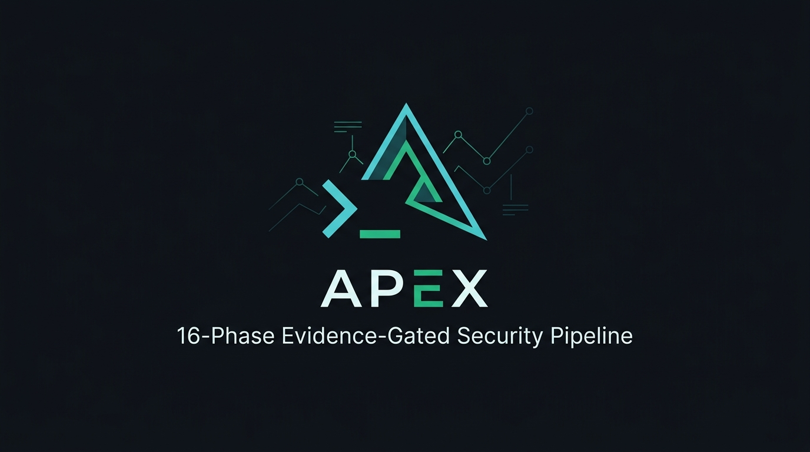

<p align="center">
  <a href="LICENSE"></a>
  
  
  
  <a href="CONTRIBUTING.md"></a>
</p>

> **Authorized use only.** This tool performs active security testing. Only run it against systems you own or have explicit written authorization to test. Unauthorized use may be a criminal offense in your jurisdiction.


## Overview

APEX is a single-file Bash pipeline that automates the early stages of authorized security research and bug-bounty reconnaissance: subdomain and asset discovery, HTTP/JavaScript intelligence, and signal-level checks for common web vulnerability classes (XSS, SQLi, SSRF, open redirect, IDOR, race conditions). It wraps well-known open-source tools (nuclei, subfinder, httpx, sqlmap, dalfox, and others) behind a strict evidence-quality gate: nothing is reported as a finding until it clears scope validation, reproducibility checks, and a confidence threshold. Every target-touching phase is consent-gated and fails closed by default — recon requires explicit authorization, and intrusive tests require an additional active-testing flag.

---

## Key Differentiators

* **Single-File Distribution:** Zero complex runtime installation or package manager hell. Pure portable Bash (~3,270 lines) with a robust built-in Native Engine (`curl`, `dig`, `jq`, `sed`, `awk`).
* **Fail-Closed ScopeGuard:** Exact suffix matches, wildcard resolution, and authoritative exclusions (`!dev.example.com`). If scope is missing or invalid, APEX refuses to touch any target.
* **Evidence-First Verification:** Eliminates false-positive clutter from Soft-404 and SPA pages by validating cryptographic content signatures (`.git`, `.env`, GraphQL schemas) and multi-request repeatability before promoting confidence scores.
* **Multi-Signal Attack Correlation:** Correlates sensitive exposures with reachable endpoints on the same host to highlight viable attack chains.
* **Automated Secret Redaction:** Live streams strip and redact JWTs, AWS credentials, GitHub tokens, Slack keys, and private keys before anything hits disk or logs.
* **Differential Run-to-Run Diffing:** Tracks delta changes between sequential scans, instantly highlighting newly emerged or resolved findings.

---

## Requirements

APEX validates its environment on startup. Run `./apex.sh doctor` at any time to verify dependencies.

### Core Dependencies (Required)
* **`bash`** (>= 4.3)
* **`jq`** (>= 1.6)
* **`curl`** & **`dig`**
* **Standard Unix utilities:** `awk`, `sed`, `grep`, `timeout`, `flock`

### Optional Recon & Testing Tools (Auto-Skipped if Missing)
If an optional tool is not present on your `PATH`, APEX automatically falls back to its built-in native inspection engine or skips that phase cleanly without crashing:
* **Asset Discovery & DNS:** `subfinder`, `amass`, `assetfinder`, `dnsx`, `naabu`
* **HTTP Probing & Crawling:** `httpx`, `katana`, `gau`, `waybackurls`, `gospider`
* **Vulnerability Scanning & Fuzzing:** `nuclei`, `ffuf`, `feroxbuster`, `dalfox`, `arjun`, `sqlmap`
* **Takeover & Analysis:** `subzy`, `wafw00f`, `gowitness`, `aquatone`, `jsluice`, `interactsh-client`

---

## Quick Start

```bash
# 1. Clone repository
git clone https://github.com/X-4xu/apex-recon.git && cd apex-recon
chmod +x apex.sh

# 2. Run environment doctor & health check
./apex.sh doctor

# 3. Launch an authorized passive + active recon scan
./apex.sh scan example.com --authorized=true
```

#### Single-File Direct Download
```bash
# Download standalone script (Always inspect shell scripts before running them!)
curl -sL https://raw.githubusercontent.com/X-4xu/apex-recon/main/apex.sh -o apex.sh && chmod +x apex.sh
```

👉 **[Read the Full Usage Guide & Configuration Reference (docs/USAGE.md)](docs/USAGE.md)**

---

## Safety & Governance Model

The safety architecture is APEX's primary design pillar:

```
                  +-------------------------+
                  | Target Domain / Input   |
                  +------------+------------+
                               |
                               v
               +-------------------------------+
               | Fail-Closed ScopeGuard        |
               | (Exact match & Exclusion gate)|
               +---------------+---------------+
                               |  IN-SCOPE
                               v
            +------------------------------------+
            | Passive OSINT & DNS Enumeration    |
            | (crt.sh, subfinder, crt APIs)      |
            +------------------+-----------------+
                               |
               +---------------+---------------+
               | Target-Touching Consent Gate  |
               | (--authorized=true)           |
               +---------------+---------------+
                               |  AUTHORIZED
                               v
            +------------------------------------+
            | Active Recon & Live HTTP Probing   |
            | (httpx, JS analysis, headers, CORS)|
            +------------------+-----------------+
                               |
               +---------------+---------------+
               | Intrusive Testing Gate        |
               | (--enable_active=true + flags)|
               +---------------+---------------+
                               |  EXPLICIT OPT-IN
                               v
            +------------------------------------+
            | Active Signal Checks (XSS, SQLi,   |
            | SSRF, IDOR differential, Race)    |
            +------------------+-----------------+
                               |
                               v
            +------------------------------------+
            | Evidence Gate & Signature Analysis |
            | (Multi-factor confidence scoring)  |
            +------------------+-----------------+
                               |
                               v
            +------------------------------------+
            | Reports: HTML, Markdown, NDJSON    |
            +------------------------------------+
```

1. **Passive OSINT Only by Default:** Subdomain lookup via external APIs requires no target interaction.
2. **Consent-Gated Recon:** Probing ports, crawling endpoints, and querying servers requires explicit authorization: `--authorized=true` or `--local_lab=true`.
3. **Double-Locked Intrusive Tests:** Fuzzing, SQLMap, SSRF probes, and race-condition bursts are completely disabled unless explicitly unlocked with `--enable_active=true` and their respective flags (`--enable_sqlmap=true`, `--enable_ssrf=true`, `--enable_race=true`).
4. **Zero Auto-Exploitation:** APEX discovers and verifies signal evidence; it never launches destructive payloads or automated exploitation.

---

## Contributing & Development

Contributions, bug reports, and pull requests are welcome! Please check out [CONTRIBUTING.md](CONTRIBUTING.md) for testing guidelines and code conventions.

## License

This project is licensed under the [MIT License](LICENSE) &copy; 2026 Hassanali.
